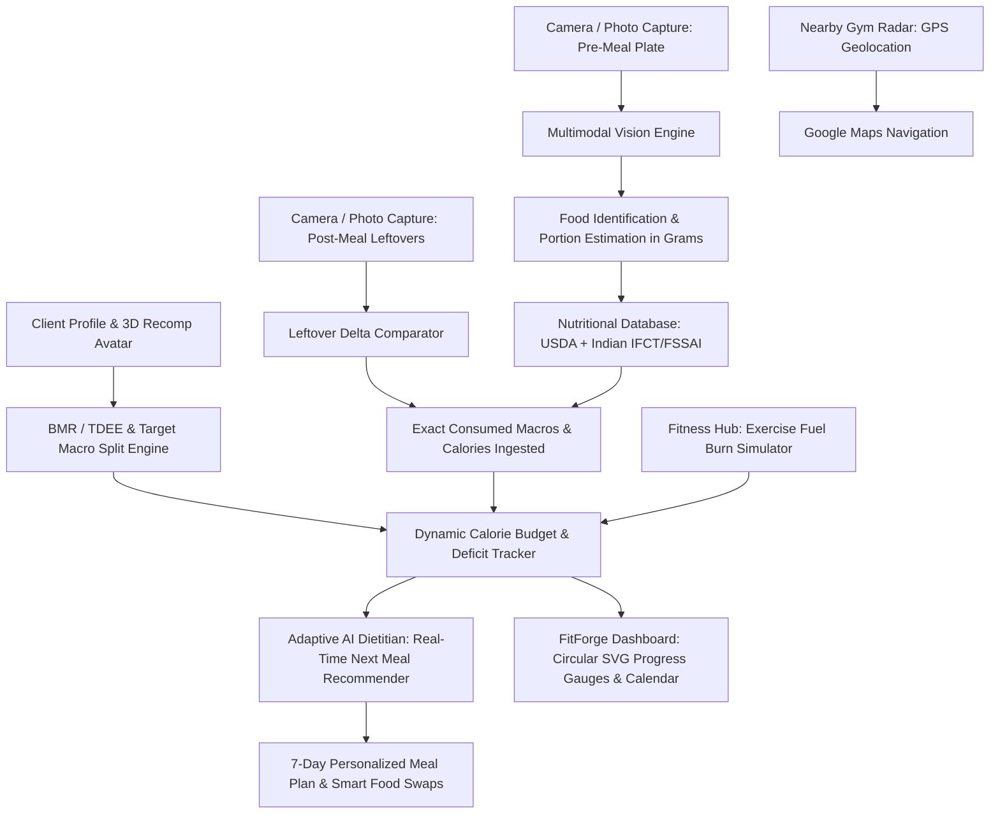

# 🥗 ThaalTatva AI: Vision-Based Nutrition & Precision Metabolic Fitness Intelligence Platform
> **Smart India Hackathon (SIH 2026)** — Real-Time Camera Food Detection, Pre-vs-Post Plate Leftover Consumption Delta Tracker, 3D Morphing Recomposition Avatar, Metabolic Target Engine, and Fitness/Gym Protocol Hub.

---

## 🌟 Overview & Problem Statement

Accurate dietary tracking and fitness transformation are the two most critical yet commonly failed aspects of modern wellness, clinical nutrition, and body recomposition. Traditional apps require tedious guessing of food weights, fail to account for **food left uneaten on the plate**, and lack integrated physiological guidance on how the human body oxidizes energy (carbohydrates vs fats) to achieve an aesthetic, healthy physique.

**ThaalTatva AI** bridges computer vision, metabolic science, and modern fitness UX into a unified platform:
1. **Live Camera & Photo Food Detection**: Detects multiple food items on a plate with bounding boxes, segmentation masks, and density-based portion weight (grams) estimation.
2. **Before-and-After Leftover Consumption Tracker**: Compares the served plate against the post-meal leftover plate to calculate the **exact net calories and nutrients consumed** vs wasted.
3. **FitForge & PowerBlast Aesthetic Interface**: Sleek obsidian/graphite dark mode with high-contrast electric volt (`#ccff00`) accents, FitForge horizontal weekly calendar, and real-time activity telemetry.
4. **3D Procedural Morphing Avatar & Intake Assessment**: Visualizes current anatomical physique and morphs smoothly into its aesthetic fit version (narrowing waist, building cap delts, upper chest, or hourglass curves) while calculating total fat mass to lose, caloric deficit required, and Zone 2 heart rate targets.
5. **Fitness, Gym & Fuel Oxidation Hub**: Scientifically breaks down how the body burns carbs (glycogen) vs fats (lipolysis) vs EPOC (afterburn effect), offers tailored aesthetic routines (PPL V-Taper, Hourglass Glute Sculpt, Calorie Torcher), and provides an interactive fuel burn simulator.
6. **Nearby Gym Radar**: Uses live browser GPS geolocation to locate top-rated gyms, CrossFit boxes, and 24/7 barbell clubs with verified amenities and direct Google Maps directions.
7. **Manual Food & Macro Ratio Intake Logger**: Log any consumed meal item with exact portion weight (grams) and custom macro ratio splits (Protein % / Carbs % / Fat %).

---

## 📐 System Architecture



---

## 🚀 Key Features

### 1. 📸 Vision Plate Scanner
- **Live Camera Capture & Upload**: Supports webcams, mobile cameras, and high-res image uploads.
- **Visual Detection Overlays**: Interactive HTML5 canvas renders glowing bounding boxes, segmented polygons, and hover detail cards.
- **Interactive Portion Sliders**: Fine-tune grams with instant real-time nutritional recalculations.
- **Nutri-Score & Glycemic Load**: Displays clinical Nutri-Scores (A to E) and Glycemic Load indicators.

### 2. ⚖️ Before & After Leftover Consumption Delta
- Side-by-side comparison of pre-meal and post-meal plates.
- Computes exact consumption percentage per item (e.g. 100% chicken eaten, 50% rice leftover = 50% eaten).
- Calculates net consumed calories, protein, carbs, fats, fiber, and sodium.
- 1-click **Log to Today's Diary** integration.

### 3. 🧬 3D Procedural Morphing Avatar & Intake Assessment
- **Customer Intake Flow**: Captures biological gender (Male V-Taper vs Female Hourglass), age, height, current weight, target goal weight, body fat % estimate, and timeline.
- **Procedural Canvas/SVG Avatar**: Renders an anatomical human silhouette with glowing energy lines.
- **Interactive Morph Slider (0% to 100%)**: Smoothly animates the transformation from current build to the aesthetic fit version (Adonis Golden Ratio 1.618 shoulder-to-waist taper or Hourglass 0.7 curve).
- **Physiological Delta Telemetry**: Net fat mass to burn (e.g. `-8.5 kg Pure Fat`), total caloric expenditure (`65,450 kcal`), recommended daily deficit (`-779 kcal/day`), and Zone 2 heart rate targets (`117-136 BPM`).
- **1-Click Protocol Activation**: Automatically calibrates client metabolic profile and updates all dashboard gauges.

### 4. 🏋️ Fitness, Gym & Shred Protocol Hub
- **Fuel Oxidation Science**: Comprehensive breakdown of Carbohydrates (Glycogen 4 kcal/g) vs Fat Lipolysis (9 kcal/g) vs EPOC (36h Afterburn).
- **The Calorie Deficit Equation**: Explains the physiology of burning 1 kg of pure adipose tissue (~7,700 kcal) safely without muscle catabolism.
- **Aesthetic Proportion Blueprints**: Golden Ratio (Adonis Index), nutrient partitioning (post-workout carb backloading), and water/sodium flush hacks to eliminate bloat.
- **Interactive Exercise Fuel Burn Simulator**: Select workout (Weightlifting, Zone 2 Incline Walk, HIIT, Stairmaster, Jump Rope, CrossFit, Cycling, Swimming) with live duration and intensity controls to compute total calories, pure fat grams oxidized, carbs burned, and EPOC bonus.
- **Structured Aesthetic Gym Routines**: PPL Aesthetic V-Taper, Hourglass & Glute Sculpt, and Metabolic Calorie Torcher.

### 5. 📍 Nearby Gym Radar (GPS Geolocation)
- **Auto-Detect GPS Location**: `navigator.geolocation` live triangulation with manual city fallback (Mumbai, Bengaluru, Delhi NCR, Pune, Hyderabad, Kolkata, Chennai).
- **Amenity Filters**: Filter by 24/7 Access, CrossFit & Functional Boxes, Steam/Sauna & Recovery, and Heavy Iron.
- **Rich Verified Gym Cards**: Distance badges (`0.8 km away`), star ratings, equipment tags (Olympic racks, heavy dumbbells, saunas), operating hours, and direct Google Maps route link.

### 6. 🥗 Manual Food Intake & Custom Macro Ratio Logger
- **Food Catalogue**: Choose from 21+ verified nutrition database foods or enter a custom recipe name.
- **Portion Weight Controller**: Input box and slider (`10g` to `800g`) with quick chips (`50g`, `100g`, `150g`, `200g`, `300g`, `500g`).
- **Macro Split Ratio Controller**: Select ratio presets (High-Protein 40/40/20, Balanced 30/50/20, Keto 25/5/70, Strict Shred 50/30/20) or customize individual sliders to calculate exact calories, protein, carbs, and fats.
- **Batch Queue & Direct Logging**: Add multiple items to a batch or log directly into the FitForge-style meal diary timeline with weight badges and macro tags.

### 7. 📊 FitForge & Panch-Tatva Dashboard
- **Weekly Calendar Strip**: Dynamic horizontal date selector (`Sun`, `Mon`, `Tue`, `Wed`, `Thu`, `Today`, `Sat`).
- **Hero Activity Overview**: Live consumed calories, net calorie deficit status (`Fat Oxidation Active`), and goal completion ring.
- **Circular SVG Progress Gauges**: Animated rings for Calories, Protein, Carbs, Fats, Fiber, and Water Hydration.

---

## 🛠️ Technology Stack

- **Backend**: Python 3, FastAPI, Uvicorn, Pydantic, Pillow, Requests.
- **Multimodal AI**: Google Gemini Vision API (`gemini-1.5-flash` / `gemini-2.0-flash`) with robust offline Heuristic Computer Vision fallback.
- **Nutritional Database**: Normalized per-100g database based on USDA FoodData Central and Indian Food Composition Tables (IFCT/NIN/FSSAI).
- **Frontend**: HTML5, Vanilla JavaScript (ES6+ Modules), HTML5 Canvas Procedural Avatar & Vision Engine, CSS3 Glassmorphism with FitForge/PowerBlast Cyber-Fitness Aesthetic.

---

## ⚡ Quickstart Guide

### 1. Clone & Run with 1-Click Script
```bash
git clone https://github.com/Subhadip24/Sih2026.git
cd Sih2026
./run.sh
```

### 2. Manual Setup
```bash
python3 -m venv .venv
source .venv/bin/activate
pip install -r requirements.txt
python3 -m uvicorn backend.app:app --host 0.0.0.0 --port 8000 --reload
```

### 3. Open in Browser
Open your browser and navigate to:
```
http://127.0.0.1:8000
```
Or view the static deployment on GitHub Pages:
```
https://subhadip24.github.io/Sih2026/
```

---

## 📡 REST API Documentation

| Method | Endpoint | Description |
| :--- | :--- | :--- |
| `GET` | `/api/health` | Health check & API status |
| `GET` | `/api/presets` | Get benchmark demo food plates |
| `POST` | `/api/analyze-plate` | Multimodal AI plate detection & portion extraction |
| `POST` | `/api/compare-plates` | Compute Pre vs Post leftover consumption delta |
| `POST` | `/api/calculate-targets` | Compute client BMR, TDEE, and daily macro splits |
| `POST` | `/api/recommend-next-meal` | Get real-time meal suggestions to fill macro deficits |
| `POST` | `/api/generate-diet-plan` | Generate full 7-day personalized diet plan |
| `GET` | `/api/smart-swaps` | Retrieve clinical healthy food swaps |
| `POST` | `/api/recalculate-portion` | Recalculate nutrients for custom grams |
| `POST` | `/api/fitness/burn-calculator` | Compute exercise calories, fat oxidized, carbs burned & EPOC |
| `POST` | `/api/fitness/avatar-recomp` | Compute body recomposition parameters & avatar morphing |
| `GET` | `/api/gyms/nearby` | Find verified gyms sorted by GPS proximity or city |

---

## 🧪 Automated Testing
Run the automated unit test suite:
```bash
python3 -m unittest discover tests
```
All 10 unit tests pass, verifying BMR/TDEE calculations, vision heuristics, leftover comparison, exercise fuel burn, avatar recomposition, and Haversine gym locator distances.
