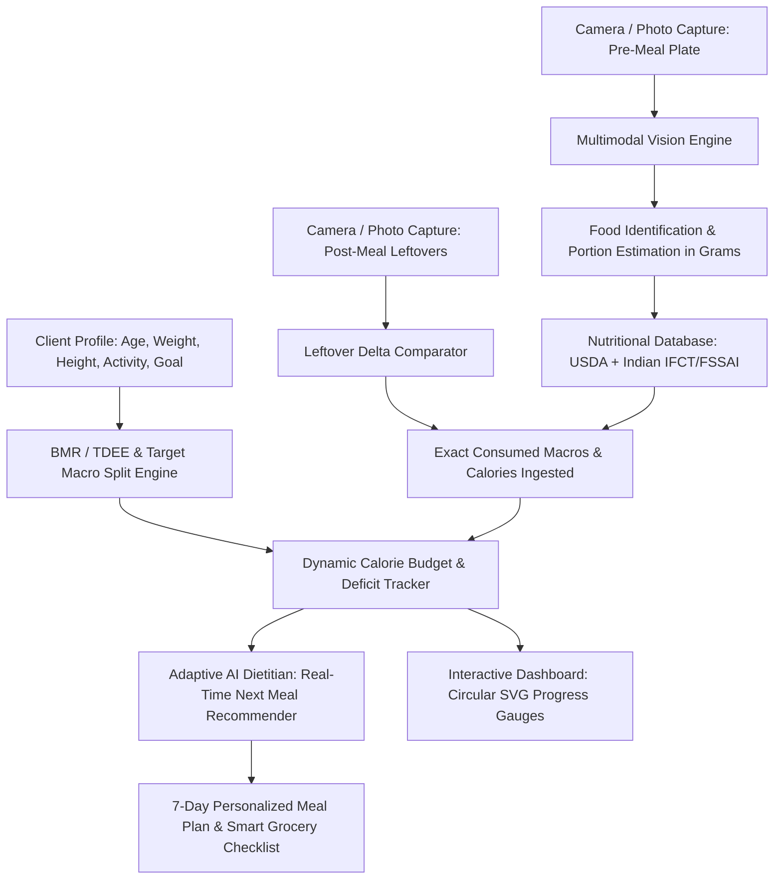

# 🥗 ThaalTatva AI: Vision-Based Nutrition & Fitness Intelligence Platform
> **Smart India Hackathon (SIH 2026)** — Real-Time Camera Food Detection, Pre-vs-Post Plate Leftover Consumption Delta Tracker, Metabolic Target Calculator, and Adaptive AI Dietitian.

---

## 🌟 Overview & Problem Statement

Accurate dietary tracking is the single most critical yet failed aspect of modern fitness, clinical wellness, and obesity management. Traditional apps require tedious manual logging, guessing food weights, and fail to account for **food left uneaten on the plate**.

**ThaalTatva AI** solves this with an end-to-end Computer Vision and Multimodal AI pipeline:
1. **Live Camera & Photo Food Detection**: Detects multiple food items on a plate with bounding boxes, segmentation masks, and density-based portion weight (grams) estimation.
2. **Before-and-After Leftover Consumption Tracker**: Compares the served plate against the post-meal leftover plate to calculate the **exact net calories and nutrients consumed** vs wasted.
3. **Dynamic Client Target Engine**: Computes BMR (Mifflin-St Jeor), TDEE, Calorie Deficit/Surplus, and exact Macro/Micro requirements tailored to client goals (Hypertrophy, Fat Loss, Diabetic Glycemic Control, Keto, Renal, DASH diet, Vegan).
4. **Adaptive AI Dietitian**: Recommends immediate next meals to close remaining daily calorie & protein deficits, generates complete 7-day personalized meal schedules, and provides smart healthier food swaps.

---

## 📐 System Architecture



---

## 🚀 Key Features

### 1. 📸 Vision Plate Scanner
- **Live Camera Capture & Upload**: Supports webcams, mobile cameras, and high-res image uploads.
- **Visual Detection Overlays**: Interactive HTML5 canvas renders glowing bounding boxes, segmented polygons, and hover detail cards.
- **Interactive Portion Sliders**: Fine-tune grams with instant real-time nutritional recalculations.
- **Nutri-Score & Glycemic Load**: Displays clinical Nutri-Scores (A to E) and Glycemic Load indicators.

### 2. ⚖️ Before & After Leftover Consumption Delta
- Side-by-side comparison of pre-meal and post-meal plates.
- Computes exact consumption percentage per item (e.g. 100% chicken eaten, 50% rice leftover = 50% eaten).
- Calculates net consumed calories, protein, carbs, fats, fiber, and sodium.
- 1-click **Log to Today's Diary** integration.

### 3. 📊 Daily Nutrition & Target Dashboard
- Animated circular SVG progress gauges for Calories, Protein, Carbs, Fats, Fiber, and Water Hydration.
- Real-time remaining budget indicators (`Consumed vs Target vs Remaining`).
- Daily Meal Diary timeline tracking Breakfast, Lunch, Snacks, and Dinner.

### 4. 🥗 Adaptive AI Diet Planner & Smart Swaps
- **Real-Time Next Meal Suggestions**: 3 tailored meal/snack options formulated to fill today's exact remaining macro deficits.
- **7-Day Personalized Meal Plan**: Monday through Sunday breakfast, lunch, snack, dinner roadmaps tailored to client targets and diet preferences.
- **Smart Food Swaps Library**: High-impact ingredient alternatives with calorie savings and nutrient boosts.
- **Printable Dietitian Report**: Clean, exportable client summary for trainers and nutritionists.

### 5. 👤 Client Profile & Metabolic Engine
- Live Mifflin-St Jeor BMR and activity-adjusted TDEE calculation.
- Specialized goal protocols: Lean Hypertrophy, Aggressive Fat Loss, Diabetic / Glycemic Control, Ketogenic, DASH Diet, and Vegan Muscle.

---

## 🛠️ Technology Stack

- **Backend**: Python 3, FastAPI, Uvicorn, Pydantic, Pillow, Requests.
- **Multimodal AI**: Google Gemini Vision API (`gemini-1.5-flash` / `gemini-2.0-flash`) with robust offline Heuristic Computer Vision fallback.
- **Nutritional Database**: Normalized per-100g database based on USDA FoodData Central and Indian Food Composition Tables (IFCT/NIN/FSSAI).
- **Frontend**: HTML5, Vanilla JavaScript (ES6+ Modules), HTML5 Canvas Overlay Engine, CSS3 Glassmorphism with Cyber-Health Dark Aesthetic.

---

## ⚡ Quickstart Guide

### 1. Clone & Run with 1-Click Script
```bash
git clone https://github.com/Subhadip24/Sih2026.git
cd Sih2026
./run.sh
```

### 2. Manual Setup
```bash
python3 -m venv .venv
source .venv/bin/activate
pip install -r requirements.txt # (or fastapi uvicorn pillow requests pydantic python-multipart google-generativeai)
python3 -m uvicorn backend.app:app --host 0.0.0.0 --port 8000 --reload
```

### 3. Open in Browser
Open your browser and navigate to:
```
http://127.0.0.1:8000
```

---

## 📡 REST API Documentation

| Method | Endpoint | Description |
| :--- | :--- | :--- |
| `GET` | `/api/health` | Health check & API status |
| `GET` | `/api/presets` | Get benchmark demo food plates |
| `POST` | `/api/analyze-plate` | Multimodal AI plate detection & portion extraction |
| `POST` | `/api/compare-plates` | Compute Pre vs Post leftover consumption delta |
| `POST` | `/api/calculate-targets` | Compute client BMR, TDEE, and daily macro splits |
| `POST` | `/api/recommend-next-meal` | Get real-time meal suggestions to fill macro deficits |
| `POST` | `/api/generate-diet-plan` | Generate full 7-day personalized diet plan |
| `GET` | `/api/smart-swaps` | Retrieve clinical healthy food swaps |
| `POST` | `/api/recalculate-portion` | Recalculate nutrients for custom grams |

---

## 🧪 Automated Testing
Run the automated test suite:
```bash
source .venv/bin/activate
python3 -m unittest tests/test_engine.py
```
